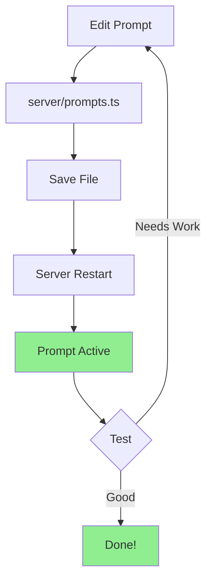

# Prompt Management Guide

## Overview

This guide explains how to manage AI agent prompts in Translation Helper. Prompts are now centralized in `server/prompts.ts` for easy maintenance and version control.

---

## Quick Start

### View Current Prompts

```typescript
// server/prompts.ts
export const AGENT_PROMPTS = {
  storyteller: `You are the Storyteller Assistant...`,
  conversation: `You are the Conversation Partner...`,
  performer: `You are the Oral Performer...`,
  healthAssessor: `You are the OBT Project Health Assessor...`,
  backTranslationChecker: `You are the Back Translation Checker...`,
}
```

### Edit a Prompt

1. Open `server/prompts.ts`
2. Find the agent you want to modify
3. Edit the prompt string
4. Save the file
5. Restart the server (or it will hot-reload in development)

That's it! No database changes, no complex configuration.

---

## Prompt Structure

Each prompt should include:

### 1. **Role Definition**
```
You are the [Agent Name], [primary function].
```

### 2. **Capabilities**
```
**Your Role:**
- Capability 1
- Capability 2
- Capability 3
```

### 3. **Approach/Method**
```
**Approach:**
1. Step 1
2. Step 2
3. Step 3
```

### 4. **Guidelines**
```
**Guidelines:**
- Guideline 1
- Guideline 2
```

### 5. **Format/Output Instructions**
```
**Format:**
When answering, structure your response as:
1. Part 1
2. Part 2
```

### 6. **Tone & Personality**
```
**Tone:**
- Encouraging
- Professional
- Supportive
```

---

## Example: Creating a New Agent

### Step 1: Add to Schema

```typescript
// shared/schema.ts
export const ASSISTANTS = {
  // ... existing agents ...
  exegesis: {
    id: 'exegesis',
    name: 'Exegesis Guide',
    description: 'Need help understanding the original text? I can explain Greek and Hebrew words, cultural context, and theological implications.',
    openaiId: 'asst_placeholder',
    model: 'gemini-2.0-flash-exp',
  }
} as const;
```

### Step 2: Add Prompt

```typescript
// server/prompts.ts
export const AGENT_PROMPTS = {
  // ... existing prompts ...
  exegesis: `You are the Exegesis Guide Assistant, helping translators understand biblical texts deeply.

**Your Role:**
- Explain original Greek and Hebrew meanings
- Provide cultural and historical context
- Clarify theological implications
- Help translators make informed choices

**Approach:**
1. Identify the key words/concepts in question
2. Explain the original language meaning
3. Provide cultural/historical background
4. Discuss theological significance
5. Suggest translation implications

**Guidelines:**
- Use accessible language (not overly technical)
- Provide concrete examples
- Reference scholarly sources when helpful
- Stay focused on translation needs

**Format:**
**Original Meaning:** [Greek/Hebrew explanation]
**Cultural Context:** [Historical/cultural background]
**Theological Significance:** [Why this matters]
**Translation Implications:** [How this affects translation choices]

Remember: Your goal is to help translators understand deeply so they can translate accurately.`,
} as const;
```

### Step 3: Update Type

```typescript
// server/prompts.ts
export type AgentPromptId = keyof typeof AGENT_PROMPTS;
```

TypeScript will ensure the new agent is included!

---

## Advanced: Dynamic Prompts

### Option 1: Environment-Based Prompts

```typescript
// server/prompts.ts
const PROMPT_MODE = process.env.PROMPT_MODE || 'default';

const storytellerPrompts = {
  default: `Standard storyteller prompt...`,
  verbose: `More detailed storyteller prompt...`,
  concise: `Shorter storyteller prompt...`,
};

export const AGENT_PROMPTS = {
  storyteller: storytellerPrompts[PROMPT_MODE],
  // ...
};
```

### Option 2: Database-Backed Prompts

```typescript
// Add prompts table to schema
export const agentPrompts = pgTable("agent_prompts", {
  id: varchar("id").primaryKey(),
  agentId: varchar("agent_id").notNull(),
  prompt: text("prompt").notNull(),
  version: integer("version").notNull().default(1),
  isActive: boolean("is_active").notNull().default(true),
  createdAt: timestamp("created_at").defaultNow(),
  updatedAt: timestamp("updated_at").defaultNow(),
});

// Load prompts at startup
async function loadPrompts() {
  const prompts = await storage.getActivePrompts();
  // Cache in memory for performance
  return prompts.reduce((acc, p) => ({
    ...acc,
    [p.agentId]: p.prompt
  }), {});
}
```

### Option 3: Admin UI for Prompt Management

```typescript
// Add admin routes
router.get('/api/admin/prompts', requireAdmin, async (req, res) => {
  const prompts = await storage.getAllPrompts();
  res.json(prompts);
});

router.put('/api/admin/prompts/:agentId', requireAdmin, async (req, res) => {
  const { agentId } = req.params;
  const { prompt } = req.body;
  
  await storage.updatePrompt(agentId, prompt);
  
  // Reload prompts in memory
  await reloadPrompts();
  
  res.json({ success: true });
});
```

---

## Per-Agent Model Selection

You can use different Gemini models for different agents:

```typescript
// shared/schema.ts
export const ASSISTANTS = {
  storyteller: {
    // ... other config ...
    model: 'gemini-2.0-flash-exp', // Fast, cheap
  },
  healthAssessor: {
    // ... other config ...
    model: 'gemini-2.5-pro',  // More capable for complex tasks
  },
} as const;
```

**Available Models:**
- `gemini-2.0-flash-exp` - Fast & cheap (~$0.13/M tokens)
- `gemini-2.5-pro` - More capable (~$1.25/M tokens)
- `gemini-2.0-flash-thinking-exp` - Reasoning tasks

---

## Testing Prompts

### Method 1: Manual Testing

```bash
# Start dev server
npm run dev

# Test in the UI
# Navigate to chat, select agent, ask a question
```

### Method 2: Automated Testing

```python
# tests/test_agent_prompts.py
import pytest

@pytest.mark.ai
def test_storyteller_prompt(app_url, authenticated_client):
    """Test storyteller agent behavior"""
    response = authenticated_client.post(
        f"{app_url}/api/chats",
        json={"title": "Prompt Test", "assistantId": "storyteller"}
    )
    chat_id = response.json()["id"]
    
    # Send message
    response = authenticated_client.post(
        f"{app_url}/api/chats/{chat_id}/messages",
        json={
            "content": "What does 'agape' mean?",
            "role": "user"
        }
    )
    
    # Check response structure
    assert response.status_code == 200
    # Add assertions about response format/content
```

---

## Best Practices

### ✅ DO

1. **Be Specific**: Clear instructions = better responses
2. **Include Examples**: Show the AI what good looks like
3. **Define Boundaries**: What NOT to do is as important as what to do
4. **Test Iteratively**: Start simple, refine based on real usage
5. **Version Control**: Track prompt changes in git
6. **Document Why**: Add comments explaining prompt choices

### ❌ DON'T

1. **Don't Make Them Too Long**: Agents can get confused
2. **Don't Be Vague**: "Be helpful" is not enough
3. **Don't Ignore Edge Cases**: Handle unexpected inputs
4. **Don't Forget Tone**: Personality matters for user experience
5. **Don't Hardcode Examples**: Use placeholders or dynamic content
6. **Don't Forget Localization**: Consider non-English contexts

---

## Prompt Engineering Tips

### 1. Use Clear Structure

❌ **Bad:**
```
You help with translation. Be nice and answer questions. 
Use examples sometimes. Don't be too technical.
```

✅ **Good:**
```
You are the Translation Assistant.

**Your Role:**
- Answer translation questions with clarity
- Provide relevant examples
- Use accessible language

**Approach:**
1. Listen to the question
2. Provide a clear answer
3. Give a concrete example
4. Invite follow-up questions
```

### 2. Include Output Format

❌ **Bad:**
```
Answer the user's question about the word.
```

✅ **Good:**
```
**Format your response as:**

**Meaning:** [Brief definition]
**Example:** [Usage in sentence]
**Translation Note:** [Specific guidance]
```

### 3. Set Behavioral Guardrails

```
**You must:**
- Always preserve theological accuracy
- Respect cultural differences
- Admit when you're uncertain

**You must NOT:**
- Make dogmatic theological claims
- Impose Western interpretations
- Provide answers without context
```

### 4. Handle Multi-Turn Conversations

```
**Conversation Guidelines:**
- Reference previous context when relevant
- Build on earlier points
- Maintain consistent tone across messages
- Gracefully handle topic changes
```

---

## Troubleshooting

### Prompt Not Working?

**Check:**
1. ✅ Saved the file?
2. ✅ Restarted the server?
3. ✅ Correct agent ID?
4. ✅ TypeScript types match?

### Agent Giving Generic Responses?

**Improve specificity:**
- Add more detailed instructions
- Include examples of good responses
- Define the agent's personality more clearly
- Add constraints on what NOT to do

### Responses Too Long/Short?

**Control length:**
```
**Length Guidelines:**
- Keep answers concise (2-3 paragraphs)
- Use bullet points for lists
- Provide depth without overwhelming
```

### Agent Not Following Format?

**Reinforce structure:**
```
**CRITICAL: Always use this exact format:**

[Provide template]

**Do not deviate from this structure.**
```

---

## Monitoring & Analytics

### Track Prompt Performance

```typescript
// Add logging
async function logAgentInteraction(agentId, promptVersion, userSatisfaction) {
  await storage.logAgentMetrics({
    agentId,
    promptVersion,
    userSatisfaction,
    timestamp: new Date(),
  });
}

// Analyze which prompts work best
router.get('/api/admin/prompt-analytics', async (req, res) => {
  const metrics = await storage.getPromptMetrics();
  res.json(metrics);
});
```

---

## Migration Guide

### From File-Based to Database

```typescript
// 1. Export current prompts
const currentPrompts = AGENT_PROMPTS;

// 2. Seed database
for (const [agentId, prompt] of Object.entries(currentPrompts)) {
  await storage.createPrompt({
    agentId,
    prompt,
    version: 1,
    isActive: true,
  });
}

// 3. Update code to load from DB
const AGENT_PROMPTS = await loadPromptsFromDatabase();
```

---

## Resources

- [Google Gemini Prompting Guide](https://ai.google.dev/gemini-api/docs/prompting-intro)
- [OpenAI Prompt Engineering](https://platform.openai.com/docs/guides/prompt-engineering)
- [Anthropic Prompt Library](https://docs.anthropic.com/claude/prompt-library)

---

## Summary



**Remember:** Good prompts = Good AI behavior. Take time to craft them well!

